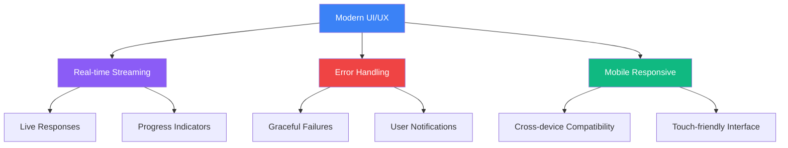
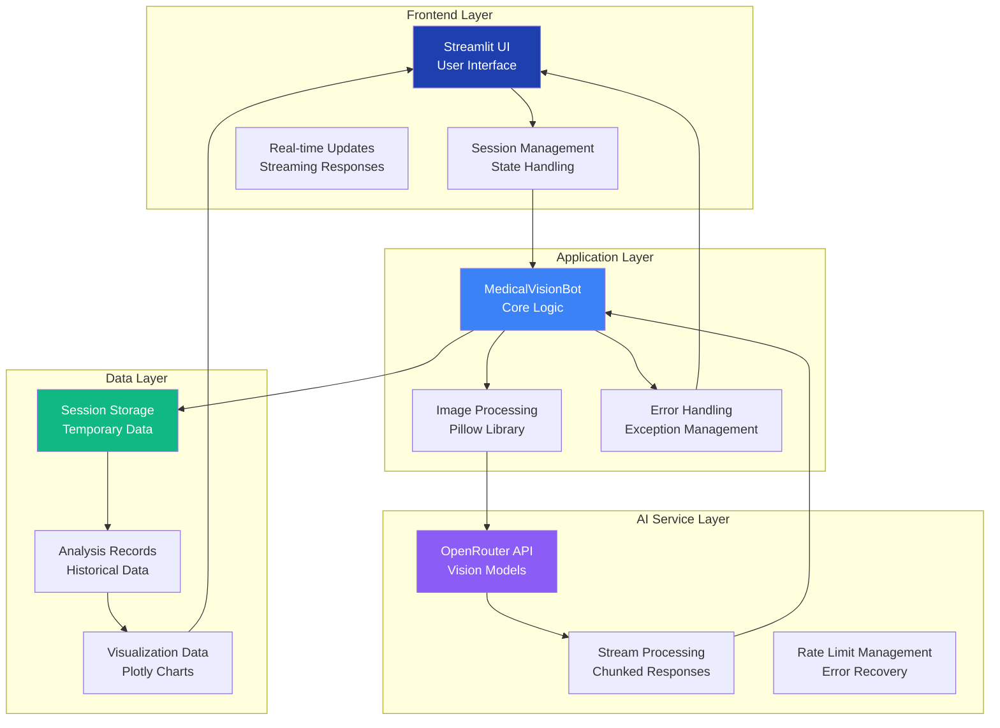
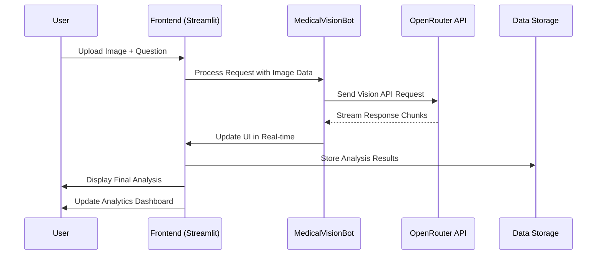
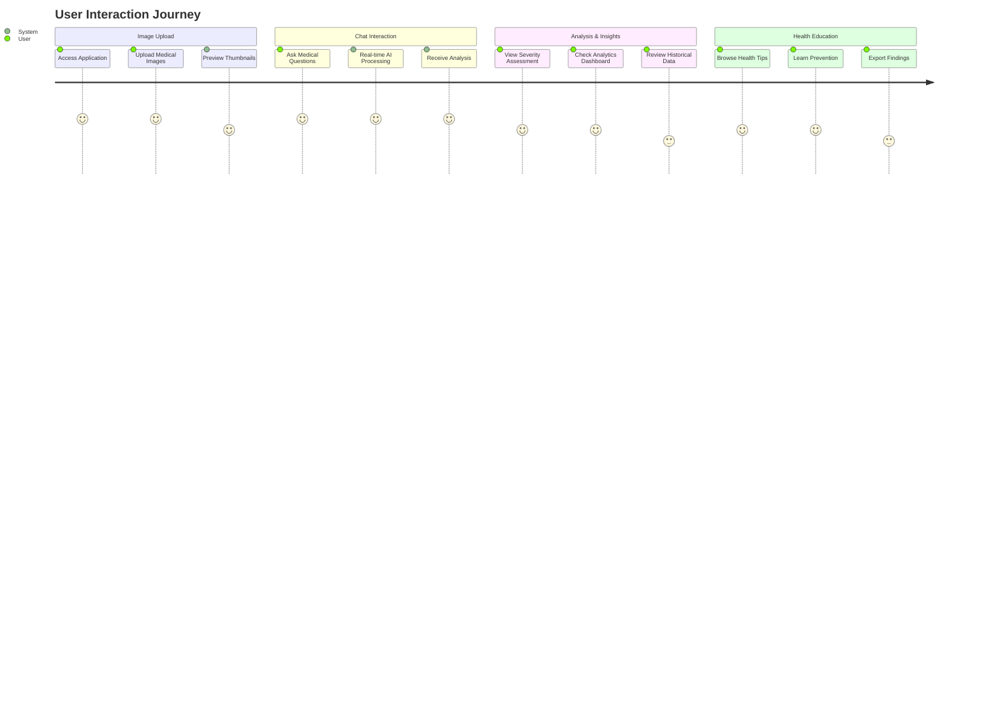
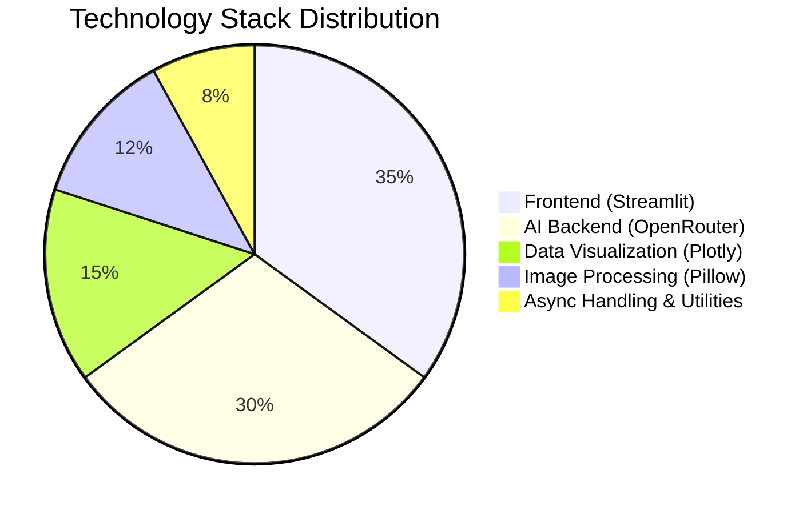
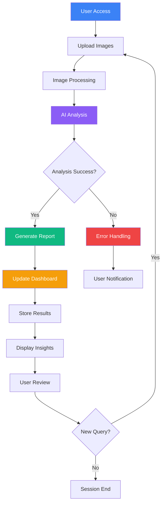
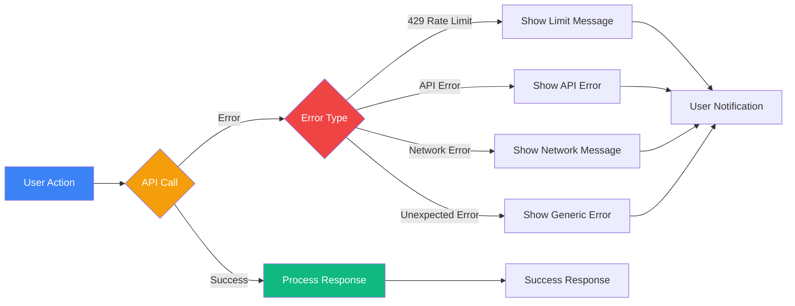
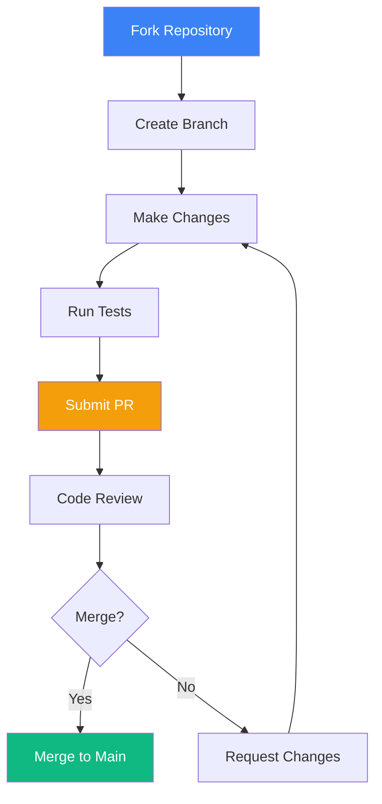

# 🏥 MedNova AI - Medical Vision Chatbot

<div align="center">

<!-- Banner -->


<!-- Badges -->
<div align="center">


</div>

**An intelligent medical vision AI assistant for educational image analysis and healthcare guidance**

<div align="center">

[](https://medical-chatbot-genai-project-dibyendu.streamlit.app/)
[](https://github.com/Dibyendu17122003/MEDICAL-CHATBOT-GENAI-PROJECT)
[](https://www.linkedin.com/in/dibyendu-karmahapatra-17d2004/)

</div>

</div>

## 📋 Table of Contents

<!-- TOC -->
- [🌟 Overview](#-overview)
- [🚀 Features](#-features)
- [🏗️ Architecture](#️-architecture)
- [📁 Project Structure](#-project-structure)
- [⚙️ Installation](#️-installation)
- [🎯 Usage](#-usage)
- [🔧 Tech Stack](#-tech-stack)
- [📊 Workflow](#-workflow)
- [🛡️ Disclaimer](#️-disclaimer)
- [🤝 Contributing](#-contributing)
- [👨‍💻 Developer](#-developer)

## 🌟 Overview

<div align="center">

**MedNova AI** represents the next generation of medical AI assistants, combining cutting-edge vision models with an intuitive interface to revolutionize medical image analysis and healthcare education.

</div>

### 🎯 What is MedNova?

MedNova AI is an **advanced medical vision chatbot** that leverages state-of-the-art AI technology to provide:
- 🔬 **Educational medical image analysis**
- 💡 **Intelligent healthcare guidance**
- 📊 **Visual analytics and insights**
- 🎓 **Learning resources for medical education**

### ✨ Key Innovations

| Feature | Innovation | Impact |
|---------|------------|--------|
| **Multi-format Support** | DICOM, PNG, JPG, JPEG | Comprehensive medical imaging |
| **Real-time Streaming** | Live AI response generation | Enhanced user experience |
| **Smart Analytics** | Automated severity assessment | Data-driven insights |
| **Educational Focus** | Patient-friendly explanations | Better health literacy |

## 🚀 Features

### 🎯 Core Capabilities

<div align="center">

| Feature Category | Capabilities | Technologies Used |
|------------------|--------------|-------------------|
| **🖼️ Image Analysis** | Multi-format support, DICOM processing, Thumbnail preview | Pillow, OpenRouter Vision |
| **💬 Intelligent Chat** | Real-time streaming, Context-aware responses, History management | Streamlit, OpenRouter API |
| **📊 Analytics Dashboard** | Severity distribution, Historical analysis, Visual insights | Plotly, Session State |
| **🎨 User Experience** | Modern UI, Mobile responsive, Error handling | Custom CSS, Streamlit Components |

</div>

### 🎨 User Experience Features



### 🔧 Advanced Functionalities

- **🔄 Session Management**: Persistent chat history and analysis records
- **📈 Progress Tracking**: Real-time response streaming with visual indicators
- **🛡️ Error Resilience**: Comprehensive error handling and user notifications
- **🎯 Smart Routing**: Multi-page navigation with state persistence
- **📱 Responsive Design**: Optimized for desktop and mobile devices

## 🏗️ Architecture

### System Architecture Overview



### Component Interaction Flow



## 📁 Project Structure

### Complete File Architecture

```
medical-chatbot-genai-project/
├── 📁 .streamlit/
│   ├── config.toml
│   └── secrets.toml
├── 📁 src/
│   ├── 📁 medical_bot/
│   │   ├── __init__.py
│   │   ├── medical_vision_bot.py
│   │   └── models.py
│   ├── 📁 error_handling/
│   │   ├── __init__.py
│   │   ├── error_utils.py
│   │   └── exceptions.py
│   └── 📁 utils/
│       ├── __init__.py
│       ├── image_processing.py
│       └── session_utils.py
├── 📁 assets/
│   ├── images/
│   └── styles/
├── 📁 tests/
│   ├── test_medical_bot.py
│   ├── test_image_processing.py
│   └── test_error_handling.py
├── 📄 app.py
├── 📄 requirements.txt
├── 📄 setup.py
├── 📄 .gitignore
├── 📄 README.md
└── 📄 LICENSE
```

### Detailed File Descriptions

| File/Folder | Purpose | Key Components |
|-------------|---------|----------------|
| **`app.py`** | Main application entry point | UI components, routing, session management |
| **`src/medical_bot/`** | Core AI logic | API integration, model definitions |
| **`src/error_handling/`** | Error management | Custom exceptions, error utilities |
| **`src/utils/`** | Utility functions | Image processing, session helpers |
| **`.streamlit/config.toml`** | Streamlit configuration | Theme, server settings |
| **`requirements.txt`** | Dependencies | All required Python packages |

## ⚙️ Installation

### 🛠️ Prerequisites

<div align="center">

| Requirement | Version | Purpose |
|-------------|---------|---------|
| **Python** | 3.8+ | Core programming language |
| **OpenRouter API Key** | - | AI model access |
| **Git** | Latest | Version control |
| **pip** | 21.0+ | Package management |

</div>

### 🚀 Quick Start Guide

```bash
# 1. Clone the repository
git clone https://github.com/Dibyendu17122003/MEDICAL-CHATBOT-GENAI-PROJECT.git
cd MEDICAL-CHATBOT-GENAI-PROJECT

# 2. Create and activate virtual environment
python -m venv mednova_env

# Windows
mednova_env\Scripts\activate

# macOS/Linux
source mednova_env/bin/activate

# 3. Install dependencies
pip install -r requirements.txt

# 4. Configure environment
# Create .streamlit/secrets.toml and add:
echo 'OPENROUTER_API_KEY = "your_api_key_here"' > .streamlit/secrets.toml

# 5. Launch the application
streamlit run app.py
```

### 📋 Complete Requirements

```txt
# Core Framework
streamlit>=1.28.0
Pillow>=10.0.0

# Data & Visualization
plotly>=5.15.0
numpy>=1.24.0
pandas>=2.0.0

# AI & API Integration
openai>=1.0.0
nest_asyncio>=1.5.0
httpx>=0.24.0

# Development & Testing
pytest>=7.0.0
black>=23.0.0
mypy>=1.0.0

# Utilities
python-dotenv>=1.0.0
typing-extensions>=4.0.0
```

### 🔧 Configuration

Create `.streamlit/config.toml`:

```toml
[theme]
primaryColor = "#1e40af"
backgroundColor = "#f3f8ff"
secondaryBackgroundColor = "#ffffff"
textColor = "#262730"
font = "sans serif"

[server]
port = 8501
address = "0.0.0.0"
```

## 🎯 Usage

### 📖 Comprehensive User Guide



### 🎮 Step-by-Step Usage

#### 1. **🖼️ Image Upload Process**
```python
# Supported formats
formats = ["png", "jpg", "jpeg", "dcm"]
max_size = "10MB per image"
features = ["Multi-file upload", "Thumbnail preview", "Format validation"]
```

#### 2. **💬 Chat Interaction**
- **Input**: Type medical questions in the chat interface
- **Processing**: Real-time AI analysis with streaming responses
- **Output**: Comprehensive medical insights and explanations

#### 3. **📊 Analytics Dashboard**
- **Severity Distribution**: Pie charts showing condition severity
- **Historical Analysis**: Review past consultations
- **Trend Visualization**: Plotly-powered interactive charts

#### 4. **❤️ Health Tips Section**
- **Preventive Care**: 25+ health recommendations
- **Lifestyle Guidance**: Diet, exercise, mental health tips
- **Educational Content**: Patient-friendly medical information

## 🔧 Tech Stack

### Technology Architecture



### Detailed Technology Breakdown

<div align="center">

| Technology | Version | Purpose | Key Features |
|------------|---------|---------|--------------|
| **Streamlit** | ≥1.28.0 | Frontend Framework | Real-time updates, Session state, Custom components |
| **OpenRouter** | Latest | AI Model Gateway | Vision models, Streaming API, Rate limiting |
| **Plotly** | ≥5.15.0 | Visualization | Interactive charts, Real-time updates, Export capabilities |
| **Pillow** | ≥10.0.0 | Image Processing | Multi-format support, Thumbnail generation, DICOM handling |
| **nest_asyncio** | ≥1.5.0 | Async Support | Event loop management, Async operation handling |

</div>

### 🛠️ Development Tools

- **Code Quality**: Black, MyPy, Pytest
- **Version Control**: Git, GitHub
- **Deployment**: Streamlit Cloud
- **Monitoring**: Streamlit analytics, Error tracking

## 📊 Workflow

### Complete Application Workflow



### Error Handling Workflow



## 🛡️ Disclaimer

<div align="center">

⚠️ **CRITICAL MEDICAL DISCLAIMER**

</div>

### 🚨 Important Safety Information

> **This application is designed for EDUCATIONAL AND INFORMATIONAL PURPOSES ONLY. It is NOT a substitute for professional medical advice, diagnosis, or treatment.**

### 🔒 Key Limitations

| Aspect | Limitation | Recommendation |
|--------|------------|----------------|
| **Accuracy** | AI models can make errors | Always verify with healthcare professionals |
| **Diagnosis** | Not for clinical diagnosis | Consult qualified medical practitioners |
| **Emergency** | Not for emergency situations | Contact emergency services for urgent care |
| **Treatment** | No treatment recommendations | Follow prescribed medical treatments |

### 📜 Compliance Notes

- 🔍 **Educational Tool**: For learning and understanding only
- 🩺 **Professional Consultation**: Always seek expert medical advice
- 📊 **Data Privacy**: Your data is handled securely but avoid sharing sensitive information
- 🔬 **Research Purpose**: Intended for medical education and research

## 🤝 Contributing

### 🎯 Contribution Guidelines

We welcome contributions from the community! Here's how you can help:

### 📝 How to Contribute



### 🛠️ Development Setup

```bash
# 1. Fork and clone
git clone https://github.com/your-username/MEDICAL-CHATBOT-GENAI-PROJECT.git

# 2. Set up development environment
pip install -r requirements-dev.txt

# 3. Run tests
pytest tests/ -v

# 4. Code formatting
black src/ app.py tests/

# 5. Type checking
mypy src/

# 6. Create pull request
git checkout -b feature/your-feature-name
```

### 🧪 Testing

```bash
# Run all tests
pytest

# Run specific test module
pytest tests/test_medical_bot.py

# Run with coverage
pytest --cov=src tests/

# Run integration tests
pytest tests/integration/ -v
```

## 👨‍💻 Developer

<div align="center">

### **Dibyendu Karmahapatra**

[](https://github.com/Dibyendu17122003)
[](https://www.linkedin.com/in/dibyendu-karmahapatra-17d2004/)
[](https://your-portfolio-link.com)

**AI & Machine Learning Enthusiast | Full Stack Developer | Medical Tech Innovator**

</div>

### 🔧 Technical Skills

- **AI/ML**: Python, TensorFlow, PyTorch, Computer Vision
- **Web Development**: Streamlit, React, FastAPI, Node.js
- **Cloud & DevOps**: AWS, Docker, CI/CD, MLOps
- **Data Science**: Pandas, NumPy, Plotly, Data Visualization

### 📫 Connect With Me

<div align="center">

[](mailto:your.email@example.com)
[](https://twitter.com/your-handle)
[](https://medium.com/@your-handle)

</div>

---

<div align="center">

## 🏆 Acknowledgments

**Special thanks to the open-source community and all contributors who make projects like this possible.**

[]()
[](LICENSE)

**⭐ Star this repo if you find it helpful!**

[](https://github.com/Dibyendu17122003/MEDICAL-CHATBOT-GENAI-PROJECT)

</div>
